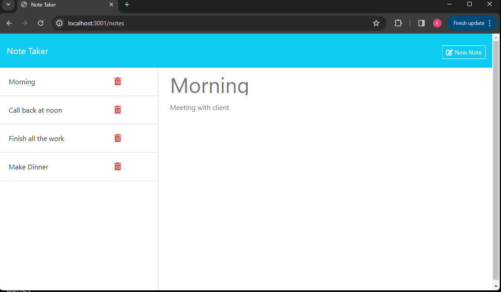

# Note Taker 

An app for creating, saving, editing and deleting plain text notes.

# Description 
This is a simple note-taking app that allows the user to create, save, and delete text-based notes.

# Table of Contents
- Installation
- Usage
- Credits
- License
- Contributing
- Tests
- Questions

#  Installation

From GitHub, fork the repo all upload all contents to the deployed webserver. The server must have Node.js installed. Once forked, run npm i from the root directory to install required dependencies. If running locally, run npm start to start the webserver.

# Usage

Access the aplication at the deployed URL : https://github.com/KittiyaLooknam/Note-Taker.git

To creat the a note will require title and text when you finish  click on "save" button. To view all saved notes click on "view notes" the see the save view. The red delete icon to delete a note.

This is the demo VDO : https://youtu.be/wCeG-RGciy8?si=WtZ0s48VR2VIZUcT

# Credits 
Thank you Louis Delia Tech Bootcamp Coding

# References 
https://www.npmjs.com/package/inquirer#documentation
https://nodejs.org/en/docs/guides/getting-started-guide
# License
[This project is licensed under the MIT license.](https://img.shields.io/badge/license-MIT-blue)

# Questions 
If you have any questions about this repo, please feel free to contact me at my email : kittya.goldberg1@hmail.com and Github profile : KittiyaLooknam

